# Project Agenda

I will start this project by introducing **Astro**. I want to explain how this platform works, how it manages Apache Airflow, and why it is such a powerful tool for scheduling and maintaining workflows. My goal is to help you understand not just what Astro is, but also how it simplifies the process of working with Airflow.  

Next, I will move on to **Apache Airflow** itself. I will talk about its importance as an open-source orchestration tool that enables us to automate ETL processes and data workflows. I will highlight the core concepts of Airflow, including workflows, scheduling, and DAGs, and show why so many engineering and data science teams rely on it.  

The main focus of the agenda is on the **ETL pipeline**. I will demonstrate how to extract data from multiple sources, perform transformations to clean and organize it, and finally load it into a target database like PostgreSQL. Using Airflow DAGs, I will show step by step how to set up these tasks—starting with pulling data from an API, applying transformations, and then saving the structured data.  

After building the pipeline, I will guide you through **deployment**. I will use Astro together with **AWS** to deploy the ETL pipeline in a way that is scalable and production-ready. This will cover everything from local setup with Docker to running workflows in a cloud environment.  

Finally, I will tie everything back to the **data science project lifecycle**. I will explain how the ETL pipeline fits into requirement gathering, data identification, engineering workflows, and the broader analytical process. By the end, you will see not only how to build and deploy an ETL pipeline but also how it contributes to the complete lifecycle of a data science project.  


# Machine Learning Project Lifecycle

## 1. Requirement Gathering and Planning
The lifecycle begins when a new data science project is initiated. At this stage, the **domain experts, product owners, and business analysts** work together to **write down all the requirements**. These requirements specify the modules, features, and outcomes expected from the project.

- If the team follows an **agile process**, the requirements are broken down into **sprints**:  
  - Sprint 1 might include 2–3 stories or modules.  
  - Sprint 2 could handle 4–5 modules.  
  - Sprint 3 might cover additional features.  

This breakdown ensures systematic progress and helps in planning team hiring and resource allocation.

---

## 2. Identifying Data Sources
Once requirements are clear, the project moves to **data identification**. Here, the **data analysts and data scientists** collaborate with domain experts and product owners to decide **what data is needed** to solve the problem.

Possible data sources include:
- Internal databases  
- Third-party APIs  
- IoT devices  
- Cloud platforms  

The focus is on **identifying the right kind of data** that aligns with the problem statement.

---

## 3. Data Engineering and Pipelines
After data sources are determined, the **big data engineering team** steps in. Their role is to build **data pipelines** that can gather, process, and deliver the data consistently.

The most common pipeline is the **ETL (Extract, Transform, Load)** pipeline:
- **Extract**: Pull data from multiple sources (databases, APIs, IoT).  
- **Transform**: Clean, combine, and convert the data (e.g., into JSON or a DataFrame).  
- **Load**: Store the transformed data into a database such as PostgreSQL, MongoDB, or AWS S3.  

Since data is **continuously updated**, ETL pipelines are not a one-time job. They must be **scheduled to run daily, weekly, or monthly**.  
Workflows ensure tasks (extract → transform → load) are executed in order, and tools like **Apache Airflow** are used to define and automate them.

---

## 4. Data Science Process
Once data pipelines are in place, the project transitions to the **data science stage**. Here, the data analysts and data scientists begin actual modeling work:

- **Feature Engineering**: Creating new features from raw data.  
- **Feature Selection**: Choosing the most relevant features for the problem.  
- **Model Training**: Using ML algorithms to train models.  
- **Model Evaluation**: Testing the model for accuracy, performance, and generalization.  

These steps form the heart of the workflow. They too can be scheduled and automated as **pipelines in Airflow**, ensuring models are retrained with fresh data.

---

## 5. Deployment and Productionization
After building the pipeline and training models, the final step is **deployment**.

- Pipelines and models are deployed in production environments, often using cloud platforms like **AWS**.  
- Tools like **Astro (Astronomer)** simplify deployment and management of Airflow-based pipelines by handling containerization (via Docker) and cloud orchestration.  
- Connections to databases (like PostgreSQL in AWS) are set up so extracted and transformed data is automatically stored in production systems.

---

## 6. Monitoring and Iteration
Even after deployment, the lifecycle does not end. Pipelines must be **monitored continuously**:
- To ensure data updates are processed regularly.  
- To confirm that workflows run on schedule.  
- To check that models remain accurate over time.  

If requirements change or performance drops, the cycle loops back — new requirements are gathered, new data identified, and pipelines updated.

---

✅ **In summary:**  
The ML lifecycle flows through:  
**requirement gathering → data identification → data engineering (ETL pipelines) → data science (modeling) → deployment → monitoring**  

Each stage is interconnected and supported by tools like **Airflow** and **Astro** for automation and scalability.


## **Project Setup**

Paste the command in terminal of vscode.

Note : make sure to download docker and winget prior this command


After running this you will see following files.


# Understanding DAGs in Airflow

## 1. What is a DAG?
In Apache Airflow, a **DAG (Directed Acyclic Graph)** is the central concept used to define workflows.  

- **Directed** → Tasks follow a specific order. For example, Task 1 must finish before Task 2 can begin.  
- **Acyclic** → The graph cannot contain loops. Once a task is completed, execution does not return to that task.  
- **Graph** → The workflow is represented as a set of connected nodes (tasks) and edges (dependencies).  

---

## 2. DAGs Represent Workflows
Each workflow in Airflow is expressed as a DAG. A DAG is composed of **tasks** (nodes), and the **dependencies** between them define the order of execution.  

For example:  
1. **Task 1** → Extract data from an API.  
2. **Task 2** → Transform the extracted data.  
3. **Task 3** → Load the transformed data into a database (e.g., PostgreSQL).  

Here, Task 2 depends on Task 1, and Task 3 depends on Task 2.  

---

## 3. Sequential and Parallel Execution
- By default, DAG tasks are executed **sequentially**, respecting their dependencies.  
- Airflow also allows **parallel execution** if tasks are independent.  
- In the ETL example, extract → transform → load must run sequentially. But if there were two independent transformations, they could run in parallel.  

---

## 4. Why "Acyclic"?
- A DAG must not contain cycles.  
- You cannot have a loop like Task 1 → Task 2 → Task 1 again.  
- Enforcing acyclic behavior ensures workflows progress forward without infinite loops.  

---

## 5. Nodes and Edges
- **Nodes** → Represent tasks (e.g., extract data, transform data, load data).  
- **Edges** → Show the direction of dependency between tasks. They indicate execution order.  

This graphical structure makes workflows easier to **visualize, manage, and debug**.  

---

## 6. Example: ETL Pipeline DAG
In this project, the DAG contains three main tasks:  

- **Task 1: Extract** → Pull weather data from an API.  
- **Task 2: Transform** → Process and clean the weather data.  
- **Task 3: Load** → Store the transformed data into PostgreSQL.  

The DAG ensures:  
1. Extraction runs first.  
2. Transformation starts only after extraction is complete.  
3. Loading happens only after transformation finishes.  

---

## DAG Visualization (Mermaid Diagram)


✅ Summary:
A DAG in Airflow is a blueprint of a workflow, defining tasks and their dependencies. It guarantees execution order (directed), prevents loops (acyclic), and provides a graph-based representation. In this project, the ETL DAG (Extract → Transform → Load) made the workflow reliable, repeatable, and easy to manage.


create py file here


## Airflow Imports
```python
from airflow import DAG
```
Explanation:
The DAG class is the foundation of every Airflow workflow. It defines the structure of the pipeline as a Directed Acyclic Graph, ensuring tasks run in the correct order without cycles. In this project, the DAG organizes tasks into Extract → Transform → Load.


2. HTTP Hook
```python
from airflow.providers.http.hooks.http import HttpHook
```
Explanation:
The HttpHook allows Airflow to communicate with external APIs. It manages HTTP connections and simplifies making requests. In this ETL project, it is used to pull live weather data from the Open-Meteo API.

3. PostgreSQL Hook
```python
from airflow.providers.postgres.hooks.postgres import PostgresHook
```

Explanation:
The PostgresHook enables Airflow tasks to connect to a PostgreSQL database and execute SQL queries. In this project, it is responsible for loading transformed weather data into a PostgreSQL table.

4. Task Decorator
```python
from airflow.decorators import task
```

Explanation:
The @task decorator makes it easier to turn Python functions into Airflow tasks. Instead of creating operators manually, we simply decorate functions like extract(), transform(), and load(). This improves readability and keeps the code concise.

5. Utility for Dates
```python
from airflow.utils.dates import days_ago
```

Explanation:
The days_ago utility provides a quick way to set relative start dates for DAGs. For example, days_ago(1) makes the DAG start from "yesterday." This is especially useful when scheduling recurring workflows.

6. Additional Python Libraries
```python
import requests
import json
```
Explanation:

requests: A standard Python library to make HTTP requests. It is used here to fetch data from APIs when working outside Airflow’s hooks.


```python
LATITUDE = '51.5074'
LONGITUDE = '-0.1278'
```
Explanation:
These values represent the geographical coordinates of the location for which we want to fetch weather data.

LATITUDE: 51.5074 → corresponds to London’s latitude.

LONGITUDE: -0.1278 → corresponds to London’s longitude.
These coordinates will be passed to the weather API (Open-Meteo) to get location-specific data.


```python
POSTGRES_CONN_ID = 'postgres_default'
```
This defines the connection ID for PostgreSQL inside Airflow.

postgres_default is the identifier used in Airflow’s Connections UI.

It stores database credentials (host, port, username, password, DB name).

The ETL pipeline uses this connection to load transformed weather data into PostgreSQL.

```python
API_CONN_ID = 'open_meteo_api'
```
Explanation:
This defines the connection ID for the external API.

open_meteo_api will be configured in Airflow’s Connections UI as an HTTP connection.

It points to the Open-Meteo weather API endpoint.

The ETL pipeline uses this connection (via HttpHook) to extract live weather data for the given latitude and longitude.


# Default Arguments in Airflow DAG

In Airflow, `default_args` is a dictionary used to define common parameters that will be applied to all tasks in the DAG unless explicitly overridden.

```python
default_args = {
    'owner': 'airflow',
    'start_date': days_ago(1)
}
```


### Explanation of Each Key

- **`owner`: 'airflow'**  
  - Indicates who is responsible for the DAG or the tasks.  
  - Mostly used for documentation and monitoring purposes.  
  - In this case, the owner is set to `"airflow"`.  

- **`start_date`: days_ago(1)**  
  - Defines when the DAG should start running.  
  - `days_ago(1)` is a helper function that sets the start date to **1 day before the current date**.  
  - Ensures the DAG starts scheduling immediately when it is first deployed.  


# Weather ETL Pipeline – DAG and Extract Task

## 1. DAG Definition
```python
with DAG(
    dag_id='weather_etl_pipeline',
    default_args=default_args,
    schedule_interval='@daily',
    catchup=False) as dags:

    # Extract Weather Data
    @task()
    def extract_weather_data():
        """Extract weather data from Open-Meteo API using Airflow Connection."""

        # Use HTTP Hook to get connection details from Airflow connection
        http_hook = HttpHook(http_conn_id=API_CONN_ID, method='GET')

        # Build the API endpoint
        endpoint = f'/v1/forecast?latitude={LATITUDE}&longitude={LONGITUDE}&current_weather=true'

        # Make the request via the HTTP Hook
        response = http_hook.run(endpoint)

        if response.status_code == 200:
            return response.json()
        else:
            raise Exception(f"Failed to fetch weather data: {response.status_code}")


    # Transform Weather Data
    @task()
    def transform_weather_data(weather_data):
        """Transform the extracted weather data."""

        current_weather = weather_data['current_weather']
        transformed_data = {
            'latitude': LATITUDE,
            'longitude': LONGITUDE,
            'temperature': current_weather['temperature'],
            'windspeed': current_weather['windspeed'],
            'winddirection': current_weather['winddirection'],
            'weathercode': current_weather['weathercode']
        }

        return transformed_data


    # Load Weather Data into PostgreSQL
    @task()
    def load_weather_data(transformed_data):
        """Load transformed data into PostgreSQL."""

        pg_hook = PostgresHook(postgres_conn_id=POSTGRES_CONN_ID)
        conn = pg_hook.get_conn()
        cursor = conn.cursor()

        # Create table if it doesn't exist
        cursor.execute("""
            CREATE TABLE IF NOT EXISTS weather_data (
                latitude FLOAT,
                longitude FLOAT,
                temperature FLOAT,
                windspeed FLOAT,
                winddirection FLOAT,
                weathercode INT,
                timestamp TIMESTAMP DEFAULT CURRENT_TIMESTAMP
            );
        """)

        # Insert transformed data into the table
        cursor.execute("""
            INSERT INTO weather_data (latitude, longitude, temperature, windspeed, winddirection, weathercode)
            VALUES (%s, %s, %s, %s, %s, %s)
        """, (
            transformed_data['latitude'],
            transformed_data['longitude'],
            transformed_data['temperature'],
            transformed_data['windspeed'],
            transformed_data['winddirection'],
            transformed_data['weathercode']
        ))

        conn.commit()
        cursor.close()

   
```

### Explanation

- **`dag_id`** → Unique identifier for the DAG (`weather_etl_pipeline`).  
- **`default_args`** → Inherits default parameters like `owner` and `start_date`.  
- **`schedule_interval='@daily'`** → Runs this workflow once every day.  
- **`catchup=False`** → Ensures only future runs are executed, not past missed ones.  

### Explanation

- **`@task()`** → Turns the Python function into an Airflow task.  
- **Purpose** → Fetches live weather data from the **Open-Meteo API**.  
- **`HttpHook`** → Connects to the API using connection details stored in Airflow (`API_CONN_ID`).  
- **Endpoint** → Dynamically constructed using:  
  - `LATITUDE` = 51.5074 (London)  
  - `LONGITUDE` = -0.1278 (London)  
  - `current_weather=true` → Ensures the API returns real-time weather data.  


## ETL Workflow (Mermaid)

```mermaid
flowchart LR
    A[Extract Weather Data<br/>HttpHook → Open-Meteo] --> B[Transform Weather Data<br/>Select & reshape fields]
    B --> C[Load to PostgreSQL<br/>CREATE TABLE IF NOT EXISTS → INSERT]
    
    %% Context
    subgraph Airflow DAG
      direction LR
      A --> B --> C
    end
```




# 📌 Explanation of the ETL Pipeline

### 1. Extract Weather Data
- Uses **HttpHook** to connect to the Open-Meteo API.  
- Builds the request URL dynamically with `LATITUDE` and `LONGITUDE`.  
- Makes an API call → if successful (`status_code == 200`), returns JSON data.  
- If it fails, raises an exception with the error code.  

---

### 2. Transform Weather Data
- Reads the `current_weather` object from the API response.  
- Extracts relevant fields: `temperature`, `windspeed`, `winddirection`, and `weathercode`.  
- Adds metadata: `latitude` and `longitude`.  
- Returns a **dictionary** (`transformed_data`) ready for loading.  

---

### 3. Load Weather Data
- Connects to PostgreSQL using **PostgresHook** (`POSTGRES_CONN_ID`).  
- Ensures the table `weather_data` exists (creates if not).  
- Inserts the transformed weather record into the table.  
- Commits the transaction and closes the connection.  

---

### ✅ Summary
This ETL pipeline consists of three tasks:  
- **Extract** → Pull weather data from Open-Meteo API.  
- **Transform** → Clean and reformat into structured data.  
- **Load** → Save into PostgreSQL for long-term storage.  

All tasks are orchestrated as Airflow tasks (`@task`), making the pipeline fully automatable.  

---

## 🔗 ETL Workflow (Mermaid Diagram)


# 📂 docker-compose.yml (PostgreSQL Setup)

This file is used to **run PostgreSQL in a Docker container**.  
Instead of installing PostgreSQL manually on your machine, we use Docker Compose to start it quickly with the required settings.  

---

### 🔑 Why do we need this file?
- It **automates the setup** of PostgreSQL.  
- Makes sure PostgreSQL always runs with the same configuration.  
- Stores data in a **volume**, so you don’t lose it when restarting the container.  
- Provides a **local database service** that the Airflow ETL pipeline can connect to.  

---


```yml
version: '3'

services:
  postgres:
    image: postgres:13
    container_name: postgres_db
    environment:
      POSTGRES_USER: postgres
      POSTGRES_PASSWORD: postgres
      POSTGRES_DB: postgres
    ports:
      - "5432:5432"
    volumes:
      - postgres_data:/var/lib/postgresql/data

volumes:
  postgres_data:
```

### 📌 Explanation of Each Part

- **`version: '3'`**  
  Defines the Docker Compose file format. Version 3 is common for most setups.  

- **`services:`**  
  A list of containers to run. Here, we only run one: `postgres`.  

- **`image: postgres:13`**  
  Uses the official PostgreSQL **version 13** image from Docker Hub.  

- **`container_name: postgres_db`**  
  Names the container `postgres_db` so it’s easier to identify and manage.  

- **`environment:`**  
  Sets up database credentials and config:  
  - `POSTGRES_USER=postgres` → database username  
  - `POSTGRES_PASSWORD=postgres` → database password  
  - `POSTGRES_DB=postgres` → default database name  

- **`ports:`**  
  Maps the container’s port **5432** to your local machine’s port **5432**.  
  → This lets you connect to the DB with `localhost:5432`.  

- **`volumes:`**  
  Creates a persistent storage volume called `postgres_data`.  
  - Ensures data is not lost when the container stops or restarts.  

---

### ✅ Summary
This `docker-compose.yml` file runs a **PostgreSQL database in Docker** with:  
- User: `postgres`  
- Password: `postgres`  
- Database: `postgres`  
- Accessible at: `localhost:5432`  
- Data stored in: `postgres_data` volume  

You can start the database with:  

```bash
docker-compose up -d
```

### Start the astro
```bash
astro dev start
```

### Now you will see fail when you trigger


### to solve this we need to create 2 connection in airflow/admin 

<!--  -->

<!--  -->

password also postgres


### Now check if the data is going to postgres for this go to containers

- for this install dbeaver
- in database select new database connection


- pass and name as postgres and test connection then finish 


- add new sql script and write script then cntl + enter

- one record as we runned airflow dag only once

Done !!!